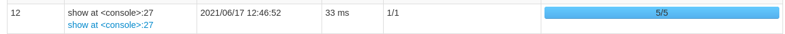
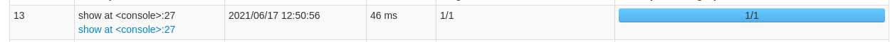
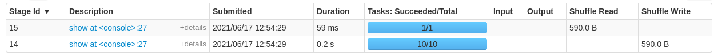

# Coalesce vs. repartition

Difference is execution model.

Within repartition (implemented as coalesce with shuffle=True), data in all partitions are randomly sent over to all executors and the result is
RDD with smaller/greater number of partitions, equally sized.

Within coalesce (shuffle=False), number of tasks are at most as given number of partitions. E.g. if numberOfPartitions=1,
one partition (with the most data) is selected and this partition "pulls" the others in just one task. This is performed on chosen executors which 
run the coalesced tasks. Data can result in uneven sized partitions. Also, upstream operations might be performed in the same task as coalesce, meaning
even if we had more partitions to that task before, it is still performed in coalesced physical Spark tasks.

## Example

Let's have a simple dataset with 10 rows where each item is in separate partition:

```
val ds = spark.range(start = 0, end = 10, step=1, numPartitions=10)
ds.show()

+---+
| id|
+---+
|  0|
|  1|
|...|
|  9|
+---+

ds.explain
== Physical Plan ==
*(1) Range (0, 10, step=1, splits=10)

ds.rdd.partitions.size
res33: Int = 10
```

Now, let's coalesce it and observe what happens:

```
ds.coalesce(1).explain

== Physical Plan ==
Coalesce 1
+- *(1) Range (0, 10, step=1, splits=10)

ds.coalesce(1).rdd.partitions.size
res36: Int = 1
```

According to the physical plan, it seems like at first we have 10 partitions; then coalesce is applied.
If we do operations in order: `map -> coalesce -> map` , we get:

```
ds.map(i => i + 1).coalesce(1).map(i => i + 1).explain
== Physical Plan ==
*(2) SerializeFromObject [input[0, bigint, false] AS value#93L]
+- *(2) MapElements $line55.$read$$iw$$iw$$iw$$iw$$iw$$iw$$iw$$iw$$Lambda$3325/0x000000084135e840@6fd02ff8, obj#92: bigint
   +- *(2) DeserializeToObject value#85: bigint, obj#91: bigint
      +- Coalesce 1
         +- *(1) SerializeFromObject [input[0, bigint, false] AS value#85L]
            +- *(1) MapElements $line55.$read$$iw$$iw$$iw$$iw$$iw$$iw$$iw$$iw$$Lambda$3324/0x000000084135f040@7e37bf, obj#84: bigint
               +- *(1) DeserializeToObject staticinvoke(class java.lang.Long, ObjectType(class java.lang.Long), valueOf, id#8L, true, false), obj#83: java.lang.Long
                  +- *(1) Range (0, 10, step=1, splits=10)
```

Here, the first map computation is performed in 10 partitions, and the second map is performed in 1 partition.
But this doesn't talk about where *physically* (which executor) the computation is performed!

What I say is - since coalesce does not create a shuffle, both map operations are performed in one task, even if the
maps use data split in different number of partitions! Observe this:

```
ds.map(i => i + 1).show()
```


```
ds.map(i => i + 1).coalesce(1).map(i => i + 1).show()
```


Now to confirm my theory, this should work as expected:

```
ds.map(i => i + 1).repartition(1).map(i => i + 1).show()
```



In the first shuffle Spark does the work as expected - in 10 tasks, then we coalesce with shuffle, by which we force
Spark to evaluate the operations in 10 tasks first and only then (in the next shuffle) reduce the partitions
