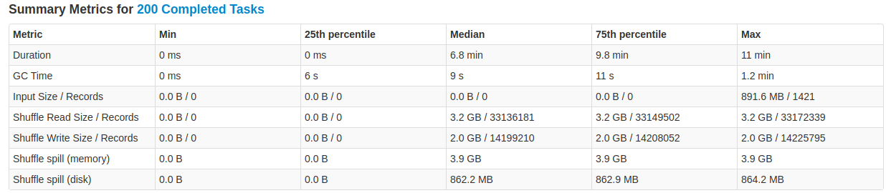
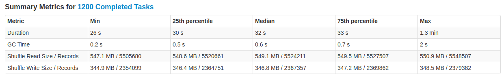

# Computing Apache Spark parameters

This guide explains how to tune essential Spark parameters so Spark applications are reasonably optimized.
The guide aims to be as practical as possible. At first, please note that there exist tons of existing literature on
this topic; I’d like to point some especially nice ones:

- https://blog.scottlogic.com/2018/03/22/apache-spark-performance.html
- https://luminousmen.com/post/spark-partitions
- https://blog.cloudera.com/how-to-tune-your-apache-spark-jobs-part-2/
- https://www.richakhandelwal.com/tuning-your-spark-jobs/
- https://luminousmen.com/post/spark-tips-partition-tuning

## TLDR: Example

### Unoptimized

- EMR 5.17.2
- 12x r5.8xlarge



- Job 6, Stage 10
- Run time: 32 minutes
- Memory and Disk spill present (bad sign)
- Partition size: at least 3.2 GB

### Optimized (memory-based approach)

- EMR 5.31
- 12x r5.8xlarge
- Addition: `spark.sql.shuffle.partitions: 1200`



- Job 6; Stage 10
- Run time: 3.7 minutes
- No memory/disk spills (good sign)
- Partition size: ~600 MB (could be even less)

## How Apache Spark works

A Spark application can be viewed from three points of view:

- The application code itself - how it’s organized and deployed in runtime
- Data - how Spark works with data, how data are organized/structured
- Job flow - how the logical data processing job is organized

Resource managers such as YARN will be left out, we’ll be focusing only on Spark itself.

### Application code

- A Spark application contains code which works with data, using RDD / DataFrame / Dataset API
- The code is compiled into a job flow "plan" (we’ll talk about it later) and the code is distributed by the "driver" and "executors".
- A "driver" is a JVM process, run from the main thread of the application:
    - since it’s a JVM process, it defines limits on:
        - memory (`spark.driver.memory`)
        - CPU (`spark.driver.cores`)
    - creates SparkSession
    - compiles code working with data into a job flow "plan"
    - distributes code between "executors"
    - responsible for broadcasting data and collection of results (when we call reduce/collect operations).
    - runs on MASTER node of the cluster (1 instance)
- An "executor" is a JVM process which executes "tasks". In addition:
    - acts as a "container", communicating with the driver though RPC (remote-procedure-call).
    - executor can run one or more tasks (driver decides how many and which ones)
    - since it’s a JVM process, it defines limits on:
        - memory (`spark.executor.memory`)
        - CPU (`spark.executor.cores`). Number of cores is also an upper limit for number of tasks executed concurrently.
    - runs on CORE nodes (many instances)
- A "task":
    - runs on 1 thread in the executor
    - consumes/processes 1 partition of data (from the input on S3/HDFS/..., or from shuffle files)
    - is outputting so-called shuffle files (intermediate results; either in memory (good) or disk (bad) ); or it’s outputting the output
    - the tasks can be independent of each other (can read various inputs)


### Data

Data which Spark application processes is also split, into so-called partitions. Initially, the number of partitions
is given by the input - e.g. number of parquet files on S3/HDFS/... we read. Later, number of partitions can change,
depending on various things:

- Type of operation
- **Number of shuffle partitions** (`spark.sql.shuffle.partitions`). Many Spark operations generate data "shuffles",
  to be processed in a next "stage" (see Job Flow below). Number of shuffles really depends on type of operation and
  the mentioned parameter, e.g.:
    - HashJoin, GroupBy, Distinct - generates hashes of column values by which we perform the operation. Then, equal
      hashes are then put into `spark.sql.shuffle.partitions` (or more) partitions:
        - exactly `spark.sql.shuffle.partitions` when number of hashes is less than or equal to `spark.sql.shuffle.partitions`
        - more than `spark.sql.shuffle.partitions` when number of hashes exceeds the value of `spark.sql.shuffle.partitions`

### Job flow

A "job" is composed of "stages", which are kind-of "layers" of computation. Some operations cannot be performed in
single pass (or stage), therefore we sometimes need more stages.

A "stage" then consists of "tasks" which need to be done. Those tasks are then executed in one executor (sometimes
multiple tasks in one executor, sometimes just one). In theory, only when all tasks are done in a stage, the computation
can follow with the next stage. However in practice, when some tasks finish, and they serve as inputs to tasks in the
next stage, the next stage can partially start, even before the previous one ends (another kind of optimization).


## Tuning Executor-oriented parameters

It can be said there are two approaches with equal outcomes:

- CPU-based
- memory-based

### CPU-based approach

Here we want to maximize number of executors with cores=1, with as smallest memory limit as possible
- memory limit should be set to the memory required by the “biggest” task in the whole job
- then the job will be stable and fast, because we will never overflow memory in the executor.
- The problem is knowing the biggest-task requirement; we must do trial-error approach

```
"spark.executor.cores" : "1"
"spark.executor.memory" : "known G"
"spark.executor.instances" : "(nodeMemory / spark.executor.memory - 1) * nodeCount"
"spark.driver.cores" : "1"
"spark.driver.memory" : "known G"
"spark.driver.maxResultSize" : "known G"
```

### Memory-oriented approach

Here we want to maximize memory of executors given by vCPUs / cores per node.

- one executor can execute spark.executor.cores tasks at once, each one requiring some memory amount.
- Here we just hope that the sum of the required memory of all tasks won’t exceed executor memory limit. 
- Ordering of tasks into executors can be different each run, so the job can pass one time, but fail another time.
  It can be less stable, but from experience generally offers good-enough memory reserve.

```
executorsPerNode = (nodeCpus - 1) / 5
totalAvailableExecutors = executorsPerNode * nodeCount
totalExecutorsForSpark = Math.max(1,totalAvailableExecutors - 1) // One executor for the Application Master in YARN

totalMemoryPerExecutor = nodeMemory / executorsPerNode
memoryOverhead = Math.max(0.384, 0.07 * totalMemoryPerExecutor)
memoryPerExecutor = totalMemoryPerExecutor - memoryOverhead

"spark.executor.cores" : "5"  // widely accepted value
"spark.executor.memory" : "${memoryPerExecutor}G",
"spark.executor.instances" : "${totalExecutorsForSpark}",
"spark.driver.cores" : "masterNodeCpus",
"spark.driver.memory" : "${memoryPerExecutor * 0.6}G",
"spark.driver.maxResultSize" : "${memoryPerExecutor * 0.6}G",
```

## Tuning Data-oriented parameters

The data-related optimizations are based on widely-accepted value of partition size:

- on HDFS: 128 MB (default HDFS block size; which should be equal to `spark.files.maxPartitionBytes`) -
  see https://luminousmen.com/post/spark-partitions 
- on S3: ?? If we think about Spark as Hadoop application, the HDFS limit should still hold

Partition size depends on:
- Input: depends on input data
- Shuffle input: depends on how tasks generate intermediate outputs (shuffle files) and `spark.sql.shuffle.partitions`.

## Example

For example, if we do a HashJoin (not Broadcast, etc.), then if the join keys are not well distributed, we can end up
in small number, but very big partitions:

- Assume default value `spark.sql.shuffle.partitions=200`
- Initially, we have e.g. 3000 partitions - e.g. columns date, ifa, count, and each partition has 300MB. As can be seen,
  data is uniformly and well distributed.
- Now if we had like 20 days of data and we do: `data.join(otherData, Seq("date", "ifa"))`, we end up with 200 partitions
- Each partition will have at least 4.5GB! (3000 partitions are moved into 200 partitions = 3000/200 = 15 partitions
  must now fit into one; 15 * 300MB = 4500 MB)
  
If we observe this, we should tune `spark.sql.shuffle.partitions` as follows:
- There exist inverse proportion between number of partitions and partition size:
  - `spark.sql.shuffle.partitions = current_partitions * current_size / wanted_size`
- we have 200 partitions, each of which has 4.5 GB. That means we have 900 GB of data to be better split.
- If we want a partition to have 128 MB, we do:

```
spark.sql.shuffle.partitions = 200 * 4500MB / 128MB = 7200
```